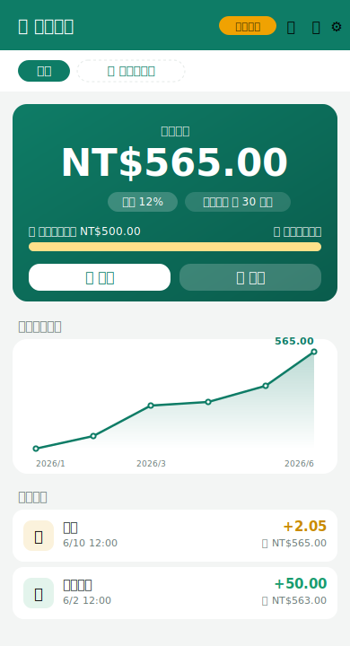

# 🏦 爸爸銀行 papa-bank

**[English](README.md) · 中文**

給孩子練習金錢觀念的「模擬銀行」。

<p align="center"></p>

**功能**
- 存款、提款（餘額不足會擋下）、交易明細
- 設定年息，時間到**自動配息**（複利；App 沒開著也會在下次打開時補算）
- 支援**多個存款人**（上方分頁切換，上限 20 位）
- **存款目標**：為每位存款人設定目標（例如「買樂高 NT$500」），餘額卡上顯示進度條，達標會慶祝 🎉
- **資料備份**：在 ⚙️設定可匯出明細 CSV（Excel 可開）、匯出完整備份 JSON、或還原備份
- **每月餘額趨勢圖** 與 **每月收支表**（存入 / 利息 / 支出 / 淨變化）
- 金額**小數位數可選**（整數 / 1 位 / 2 位）
- 明細多時自動**分頁**
- **中 / 英** 一鍵切換（右上「中/EN」）
- **家長唯讀鎖**：設定密碼後，按 🔓 進入「孩子檢視模式」，只能看不能改；解鎖需密碼

**模式**
- 純前端、零安裝、零費用。
- **本機模式**：直接用，資料存在這台裝置。
- **雲端同步模式**：填入免費的 Firebase 設定後，電腦操作、手機看明細，多裝置共用同一份資料。

---

## 1. 馬上開始（本機模式）

直接用瀏覽器打開 `index.html`（雙擊即可）。

> 建議用 Chrome / Edge。資料會存在這個瀏覽器裡，換裝置或清除瀏覽器資料就會不見。
> 想跨裝置同步、永久保存，請做下面第 3 節的 Firebase 設定。

### 怎麼教孩子？
1. 按 **＋新增存款人**，輸入名字與年息（例如 5%）。
2. 給零用錢時按 **＋存款**，可以加備註（例如「洗碗獎勵」）。
3. 想買東西時按 **－提款**（餘額不足會擋下來，讓孩子學會量入為出）。
4. 在 **⚙️設定** 把「配息頻率」改成 **每分鐘（測試加速）**，幾分鐘內就能看到利息一直長大，
   很適合用來解釋「複利」；教完再改回「每月」。

---

## 2. 想放到網路上、手機也能開？

把這個資料夾的檔案上傳到任一免費靜態空間即可（擇一）：
- **Firebase Hosting**（和下面同步功能同一個專案，最省事）
- GitHub Pages / Cloudflare Pages / Netlify / Vercel

手機開啟網址後，可用瀏覽器選單「加入主畫面」，就像一個 App。

---

## 3. 開啟多裝置同步（免費的 Firebase）

> 用量極小，屬於 Firebase 免費方案（Spark），長期免費、不需綁信用卡。

1. 到 <https://console.firebase.google.com> 用 Google 帳號登入，點 **新增專案**，名字隨意。
2. 先把 **`firebase-config.example.js`** 複製成 **`firebase-config.js`**（真正的設定檔已被 gitignore，金鑰不會上 GitHub）。
   再進專案，點左上齒輪 → **專案設定 → 一般** → 最下方「你的應用程式」選 **Web（</>）**，
   取個暱稱、建立，會看到一段 `firebaseConfig`。把裡面的
   `apiKey / authDomain / projectId / appId` 複製到 **`firebase-config.js`**。
3. 左側選單 **建構 → Authentication → 開始使用 → 選「電子郵件/密碼」並啟用**。
4. 左側選單 **建構 → Firestore Database → 建立資料庫**（選正式版 / 離你近的地區）。
5. 在 Firestore 的 **規則（Rules）** 分頁，貼上下面這段並發布（只有登入者能存取自己的資料）：

   ```
   rules_version = '2';
   service cloud.firestore {
     match /databases/{database}/documents {
       match /banks/{docId} {
         allow read, write: if request.auth != null
           && docId.matches(request.auth.uid + '_.*');
       }
     }
   }
   ```

6. 重新整理 `index.html`，會出現登入畫面。輸入一組家庭 Email 與密碼（至少 6 碼），
   **第一次會自動註冊**。之後所有裝置都用這組帳密登入，就會看到同一份資料。

完成後，右上角徽章會從「本機模式」變成「雲端同步」。

---

## 檔案說明
| 檔案 | 用途 |
|------|------|
| `index.html` | 畫面結構 |
| `styles.css` | 樣式 |
| `app.js` | 所有邏輯（存提款、利息、明細、圖表、分頁、鎖、同步）|
| `i18n.js` | 中英文字典 |
| `firebase-config.js` | 雲端同步設定（留空＝本機模式）|

## 兒童模式 / 爸爸模式
這個 App **預設就是兒童模式（唯讀）**：只能看餘額、明細、趨勢，**不能**存提款、設定、或新增存款人。

1. **第一次使用**：按右上 **🔒** → 設定一組「爸爸密碼」，即進入爸爸模式。
2. **之後**：按 **🔒** → 輸入爸爸密碼 → 進入爸爸模式，才會出現存款、提款、設定、新增存款人。
3. 想改密碼：在爸爸模式按 **⚙️設定**，裡面可修改。
4. 回到兒童模式：按 **🔓** 手動鎖回，或**閒置 3 分鐘**自動鎖回，或**重新整理 / 重開** App 也會回到兒童模式。

> **安全須知（誠實說明）**：爸爸模式只存在「當次開啟」，重開就要重新認證，這能擋住一般小孩。
> 但密碼是存在資料裡的，**懂得開開發者工具（DevTools）的人仍可能繞過**。
> 若需要真正「從資料庫層級就只能讀不能寫」，得在雲端模式另開孩子專用帳號並調整 Firestore 規則 —— 需要時跟我說。
> 另外：**若忘記爸爸密碼**，本機模式只能清除瀏覽器資料重來（資料會一起消失）；雲端模式可到 Firebase 主控台手動修改該筆資料。

## 利息怎麼算？
每到一個「配息週期」（每月／每天／每分鐘測試），就把
`目前餘額 × 年息 ÷ 期數` 的利息存進帳戶；因為利息會併入本金，所以是**複利**。
利息用「時間戳記」計算，所以即使 App 沒開著，下次打開也會把該發的利息一次補上。

## 限制與安全須知（誠實說明）
- **存款人上限 20 位**；單筆金額上限 10 億；年息上限 1000%（避免誤輸入天文數字）。
- **每月收支 / 趨勢圖只顯示最近 24 個月**，避免列表無限變長。
- 金額輸入會擋掉空白、負數、`Infinity`、過大數字；資料若損毀會自動退回乾淨的初始狀態，不會卡白畫面。
- **預設是兒童模式（唯讀）**，要輸入爸爸密碼才會進入可編輯的爸爸模式（重開或閒置 3 分鐘自動回兒童模式）。
  這擋得住一般小孩，但**懂 DevTools 的人仍可能繞過**；要真正的資料庫層級唯讀，得在雲端模式另開孩子帳號 + 調整 Firestore 規則。詳見下方「兒童模式 / 爸爸模式」。
- **雲端模式預設開放註冊**：任何人都能在你的 Firebase 專案註冊帳號（只能看到自己的資料，看不到你的）。
  介意的話，可在 Firebase 主控台 **Authentication → Settings** 關閉公開註冊，只留你自己的帳號。
